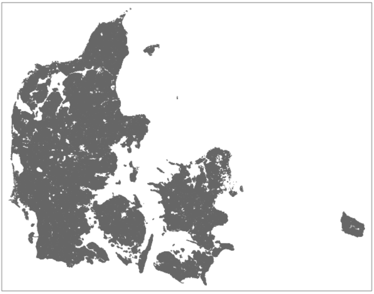

<!-- PROJECT LOGO -->
<br />
<p align="center">
  <a href="https://github.com/emiltj/groundwater_pollution_dk">
    
  </a>

  <h3 align="center">Groundwater pollution and farm use in Denmark</h3>

  <p align="center">
    Spatial analysis exam project 2021
    <br />
    <a href="https://github.com/emiltj/groundwater_pollution_dk"><strong>Explore the docs »</strong></a>
    <br />
    <br />
    <a href="https://github.com/emiltj/groundwater_pollution_dk">View Demo</a>
    ·
    <a href="https://github.com/emiltj/groundwater_pollution_dk/issues">Report Bug</a>
    ·
    <a href="https://github.com/emiltj/groundwater_pollution_dk/issues">Request Feature</a>
  </p>
</p>

## About The Project



## Setup for reproduction
The spatial analysis requires data layers that exceed the maximum filesize on GitHub. To reproduce the analysis the script ```data/data_download.rmd``` has been provided. It will automatically download the files contained within [a Google Drive folder](https://drive.google.com/drive/folders/1ZbnRr2CnVcMm0M2-v3AN7aOMlW5HMXfT?usp=sharing). 

For rerunning the analysis we therefore recommend cloning the repository, as well as using the provided script for downloading the data.
This can be done using the following lines in an unix-based bash:

```bash
git clone https://github.com/emiltj/spatial_exam.git
cd groundwater_pollution_dk/data
bash data_download.sh
```

## Repository structure
This repository has the following directory structure:

| Column | Description|
|--------|:-----------|
```spatial_analysis.md```| Markdown of the spatial analysis
```spatial_analysis.rmd```| Script used for the spatial analysis
```data/``` | Folder which contains the data required for the analysis
```data/data_download.sh``` | Script which downloads the data required for the analysis
```README.md``` | Readme with instructions
```LICENSE``` | [Apache License 2.0](https://www.apache.org/licenses/LICENSE-2.0) which specifies the permitted usage of the repository

## Data layers
After running ```data/data_download.sh``` the data layers will have been downloaded to ```data/```

## Contributions

## License
Distributed under the [Apache License 2.0](https://www.apache.org/licenses/LICENSE-2.0). See ```LICENSE``` for more information.


## Contact

Feel free to write the authors, Emil Jessen or Johan Horsmans for any questions regarding the scripts.
You may do so on Slack ([Emil](https://app.slack.com/client/T01908QBS9X/D01A1LFRDE0), [Johan](google.dk))
