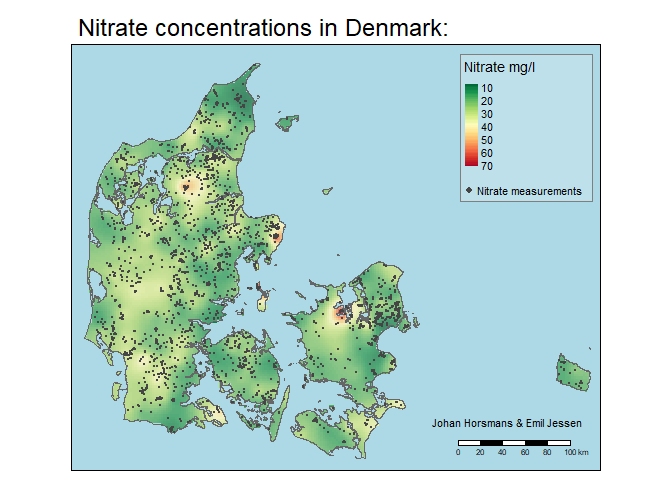

<!-- PROJECT LOGO -->
<br />
<p align="center">
  <a href="https://github.com/emiltj/groundwater_pollution_dk">
    
  </a>

  <h3 align="center">Groundwater pollution and farm use in Denmark</h3>

  <p align="center">
    Spatial analysis exam project 2021
    <br />
    <a href="https://github.com/emiltj/groundwater_pollution_dk/report.pdf"><strong>Read the report»</strong></a>
    <br />
    <br />
    <a href="https://github.com/emiltj/groundwater_pollution_dk/groundwater_pollution_dk.md">View markdown</a>
    ·
    <a href="https://github.com/emiltj/groundwater_pollution_dk/issues">Report bug</a>
    ·
    <a href="https://github.com/emiltj/groundwater_pollution_dk/issues">Request feature</a>
  </p>
</p>


<!-- TABLE OF CONTENTS -->
<details open="open">
  <summary>Table of Contents</summary>
  <ol>
    <li>
      <a href="#about-the-project">About the project</a>
    </li>
    <li>
      <a href="#getting-started">Getting started</a>
      <ul>
        <li><a href="#prerequisites">Prerequisites</a></li>
      </ul>
    </li>
    <li><a href="#repository-structure">Repository structure</a></li>
    <li><a href="#data">Data</a></li>
    <li><a href="#usage">Usage</a></li>
    <li><a href="#contributing">Contributing</a></li>
    <li><a href="#license">License</a></li>
    <li><a href="#contact">Contact</a></li>
    <li><a href="#acknowledgements">Acknowledgements</a></li>
  </ol>
</details>


<!-- ABOUT THE PROJECT -->
## About the project

<p align="center"></p>
<p align="center"><em>Example visualization from the project, showing nitrate measurement placements and kriged nitrate concentrations in the groundwater </em>
</p>

This project analyzes the relationship between land use and nitrate pollution in the groundwater in Denmark. It investigates the ... bla. bla...

Why this analysis?
* Y
* Y
* Y

Findings of the analysis:
* Y
* Y
* Y

Of course,


<!-- GETTING STARTED -->
## Getting started

To get a local copy up and running follow these simple example steps.

### Prerequisites

The spatial analysis requires data layers that exceed the maximum filesize on GitHub. To reproduce the analysis the script ```data/data_download.sh``` has been provided. It will automatically download the files contained within [a Google Drive folder](https://drive.google.com/drive/folders/1ZbnRr2CnVcMm0M2-v3AN7aOMlW5HMXfT?usp=sharing). 

For rerunning the analysis we therefore recommend cloning the repository, as well as using the provided script for downloading the data.
This can be done using the following lines in an unix-based bash:

```bash
git clone https://github.com/emiltj/spatial_exam.git
cd groundwater_pollution_dk
bash data_download.sh
```

<!-- REPOSITORY STRUCTURE -->
## Repository structure
This repository has the following structure:

| Column | Description|
|--------|:-----------|
```spatial_analysis.md```| Markdown of the spatial analysis
```spatial_analysis.rmd```| Script used for the spatial analysis
```data/data_download.sh``` | Script which downloads the data required for the analysis
```data/nitrat.csv```| Groundwater samples containing information on nitrate and geographical coordinates of samples in the period 1900-2021.
```data/REGION.*```| Shapefiles containing a map of Denmark, by regions.
```data/Markblok.*```| Shapefiles containing polygons of fields in Denmark in the period 1990-2021.
```data/Oekologiske_arealer.*```| Shapefiles containing polygons of organic field in 2018-2021
```README_images/*.png```| Images used for the README
```README.md``` | Readme with instructions
```LICENSE``` | [Apache License 2.0](https://www.apache.org/licenses/LICENSE-2.0) which specifies the permitted usage of the repository


<!-- USAGE EXAMPLES -->
## Data

<!-- USAGE EXAMPLES -->
## Usage

For simply examining the analysis and its results, we recommend inspecting the markdown version of the analysis.
* <a href="groundwater_pollution_dk.md">```spatial_analysis.md```</a>


<!-- CONTRIBUTING -->
## Contributing

Contributions are what make the open source community such an amazing place to be learn, inspire, and create. Any contributions you make are greatly appreciated.

1. Fork the Project
2. Create your Feature Branch (`git checkout -b analysis/extended_analysis`)
3. Commit your Changes (`git commit -m 'Add some extended_analysis'`)
4. Push to the Branch (`git push origin analysis/extended_analysis`)
5. Open a Pull Request


<!-- LICENSE -->
## License
Distributed under the [Apache License 2.0](https://www.apache.org/licenses/LICENSE-2.0). See ```LICENSE``` for more information.


<!-- CONTACT -->
## Contact

Feel free to write the authors, Emil Jessen or Johan Horsmans for any questions regarding the scripts.
You may do so on Slack ([Emil](https://app.slack.com/client/T01908QBS9X/D01A1LFRDE0), [Johan](google.dk))


<!-- ACKNOWLEDGEMENTS -->
## Acknowledgements
* [RStudio](https://www.rstudio.com/) - Software used for conducting the analysis
* [GEUS-DATA](https://www.geus.dk/) - Data portal for geological investigations in Denmark/Greenland
* [Danish Agricultural Agency](https://lbst.dk/landbrug/kort-og-markblokke/) - The Danish Agricultural Agency portal, containing geographical information on land use 
* [README template](https://github.com/othneildrew/Best-README-Template) - README template by othneildrew
* Rstudio
* Leaflet
