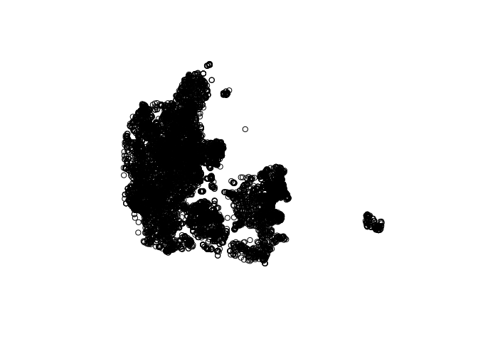
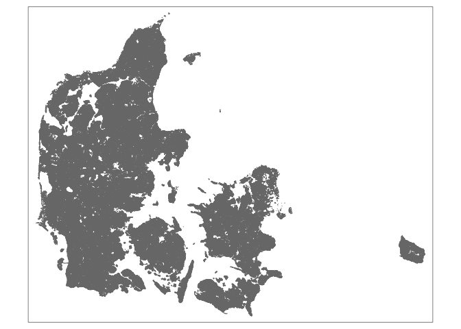

groundwater\_pollution\_dk
================
Johan Horsmans
4/26/2021

``` r
library(pacman)

p_load(sf, raster, dplyr, tmap, ggplot2, tidyverse)
```

``` r
nitrate <- as.data.frame(read_csv("nitrate/nitrate.csv")) #Load the .csv-file as a dataframe and save it as "nitrates".
```

    ## 
    ## ── Column specification ────────────────────────────────────────────────────────
    ## cols(
    ##   WKT = col_character(),
    ##   `Vis data` = col_character(),
    ##   DGUnr. = col_character(),
    ##   Borerapport = col_character(),
    ##   Indtag = col_double(),
    ##   Analyser = col_double(),
    ##   `Median mg/l` = col_double(),
    ##   `Min. mg/l` = col_double(),
    ##   `Maks. mg/l` = col_double(),
    ##   `Indtag topdybde` = col_double(),
    ##   `Topdybde forklaret` = col_character(),
    ##   Seneste = col_date(format = ""),
    ##   `Seneste mg/l` = col_double(),
    ##   objectid = col_double(),
    ##   symbol_ident = col_character(),
    ##   symbol_size = col_double(),
    ##   symbol_txt_size = col_double(),
    ##   txt_search = col_character(),
    ##   rgb = col_character()
    ## )

``` r
nitrateagg <- as.data.frame(read_csv("nitrate/nitrate aggregated.csv")) #Load the .csv-file as a dataframe and save it as "nitrateagg".
```

    ## 
    ## ── Column specification ────────────────────────────────────────────────────────
    ## cols(
    ##   WKT = col_character(),
    ##   Analyser = col_double(),
    ##   `Gns. mg/l` = col_double(),
    ##   `Min. mg/l` = col_double(),
    ##   `Maks. mg/l` = col_double(),
    ##   `Gns. topdybde` = col_double(),
    ##   `Min. topdybde` = col_double(),
    ##   `Maks. topdybde` = col_double(),
    ##   `Min. dato` = col_date(format = ""),
    ##   `Maks. dato` = col_date(format = ""),
    ##   objectid = col_double(),
    ##   rgb = col_character(),
    ##   txt_search = col_logical()
    ## )

Processing the nitrate.csv-file into a compatible format.

``` r
nitrate <- nitrate
nitrate$WKT <- as.character(nitrate$WKT)
nitrate$WKT <- gsub("POINT \\(", "", nitrate$WKT)
nitrate$WKT <- gsub(")", "", nitrate$WKT)
```

Separate into two columns

``` r
nitrate <- nitrate %>% 
  separate(col = WKT, into = c("longitude","latitude"), sep = " ")
```

Making it a shapefile

``` r
nitrate <- st_as_sf(nitrate, coords = c("longitude", "latitude"))
```

Plotting the points

``` r
plot(st_geometry(nitrate))
```

<!-- -->

\#Agg

``` r
#test <- structure(list(Shape = c(1.1, 1.1, 1.1, 1.1), 
                    #   long = c(43L, 43L, 40L, 40L), 
                     #  lat = c(10L, 13L, 13L, 10L)), 
                  #class = "data.frame", 
                  #row.names = c("1", "2", "3", "4"))
##

#test <- as.matrix(rbind(test[,-1], test[1, -1]))

#Coord_Ref <- st_crs(3035)
#plot_locations_test <- st_polygon(x = list(test))
#plot_locations_test <- st_sfc(plot_locations_test, crs = Coord_Ref)
#ggplot(plot_locations_test) + geom_sf(fill = "red", alpha = 0.1)
```

``` r
marker <- st_read("farm_layers/Markblok.shp") %>% na.omit() #loading raster containing farm polygons
```

    ## Reading layer `Markblok' from data source `/home/cds-au618771/cds-spatial/groundwater_polution_dk/farm_layers/Markblok.shp' using driver `ESRI Shapefile'
    ## replacing null geometries with empty geometries
    ## Simple feature collection with 476658 features and 6 fields (with 1 geometry empty)
    ## geometry type:  POLYGON
    ## dimension:      XY
    ## bbox:           xmin: 442061.7 ymin: 6049864 xmax: 892661.5 ymax: 6401571
    ## proj4string:    +proj=utm +zone=32 +ellps=GRS80 +units=m +no_defs

``` r
tm_shape(marker) + tm_polygons() #Plotting farms
```

<!-- -->
