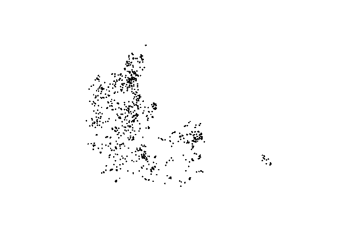
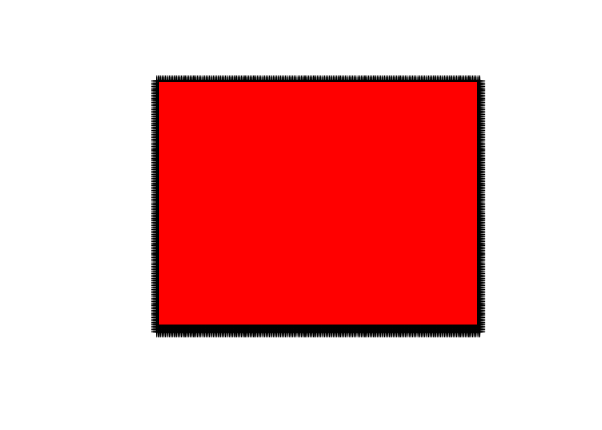
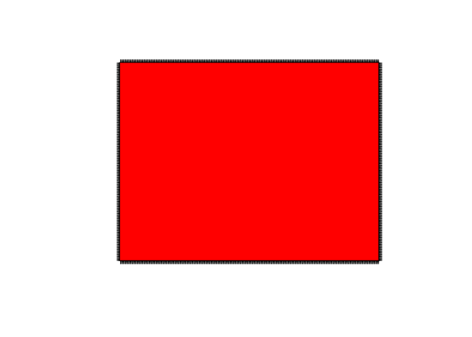

groundwater\_pollution\_dk
================
Johan Horsmans
4/26/2021

``` r
library(pacman)

p_load(sf, raster, dplyr, tmap, ggplot2, tidyverse, lubridate, sp, gstat)
```

``` r
nitrate <- as.data.frame(read_csv("data/nitrate.csv")) #Load the .csv-file as a dataframe and save it as "nitrate".
```

    ## 
    ## ── Column specification ────────────────────────────────────────────────────────
    ## cols(
    ##   WKT = col_character(),
    ##   `Vis data` = col_character(),
    ##   DGUnr. = col_character(),
    ##   Borerapport = col_character(),
    ##   Indtag = col_double(),
    ##   Analyser = col_double(),
    ##   `Median mg/l` = col_double(),
    ##   `Min. mg/l` = col_double(),
    ##   `Maks. mg/l` = col_double(),
    ##   `Indtag topdybde` = col_double(),
    ##   `Topdybde forklaret` = col_character(),
    ##   Seneste = col_date(format = ""),
    ##   `Seneste mg/l` = col_double(),
    ##   objectid = col_double(),
    ##   symbol_ident = col_character(),
    ##   symbol_size = col_double(),
    ##   symbol_txt_size = col_double(),
    ##   txt_search = col_character(),
    ##   rgb = col_character()
    ## )

``` r
#Rename columns to remove spaces:
names(nitrate)[names(nitrate) == "Seneste"] <- "Seneste_måling" 
names(nitrate)[names(nitrate) == "Seneste mg/l"] <- "Seneste_mgl"
```

Remove outliers

``` r
nitrate <- nitrate %>%
  filter_at(vars("Seneste_mgl"), any_vars(. < 200))
```

Processing the nitrate.csv-file into a compatible format.

``` r
nitrate$WKT <- as.character(nitrate$WKT)
nitrate$WKT <- gsub("POINT \\(", "", nitrate$WKT)
nitrate$WKT <- gsub(")", "", nitrate$WKT)
```

Separate into two columns

``` r
nitrate <- nitrate %>% 
  separate(col = WKT, into = c("longitude","latitude"), sep = " ")
```

Making it a shapefile

``` r
nitrate <- st_as_sf(nitrate, coords = c("longitude", "latitude"))
```

Filtering dates between 2018 and 2021:

``` r
nitrate <- nitrate %>%
 select(Seneste_måling, Seneste_mgl, geometry) %>%
 filter(Seneste_måling >= as.Date("2018-01-01") & Seneste_måling <= as.Date("2021-03-10"))
```

Remove duplicate entries (for the purpose of kriging)

``` r
nitrate<-nitrate[!duplicated(nitrate$geometry), ]
```

Plotting the points

``` r
plot(st_geometry(nitrate))
```

<!-- -->

\#Exploratory statistics:

``` r
summary(nitrate$Seneste_mgl)
```

    ##    Min. 1st Qu.  Median    Mean 3rd Qu.    Max. 
    ##    2.00    6.60   18.00   25.69   36.00  190.40

``` r
hist(nitrate$Seneste_mgl)
```

<!-- -->

Plotting points with nitrate per. mg/l metric:

``` r
ggplot(nitrate) +
  geom_sf(aes(col = Seneste_mgl)) 
```

<!-- -->

# Kriging:

Creating X- and Y-value columns

``` r
nitrate$X <- st_coordinates(nitrate)[,1]
nitrate$Y <- st_coordinates(nitrate)[,2]
```

Make variogram by fitting X- and Y coordinates to nitrate mg/l with a
linear regression

``` r
vgm <- variogram(nitrate$Seneste_mgl ~ X + Y, nitrate)
plot(vgm)
```

<!-- -->

ADELAS TEXT: “You might imagine that if soil at a particular point is
nutrient-rich, then soil one metre away is likely to be fertile too. But
can you say the same thing about soil one kilometre away, or ten
kilometres, or one hundred kilometres?”

JOHANS TEXT: “It appears that it is very hard to find spatial
correlations in the data. Nonetheles, it appears that the first 30000
(units) are more correlated than those further away. As such, we argue
that this model can be used for kriging, since it only needs to
interpolate data that is close to”real" data".

Fit a model to the variogram:

``` r
# Eyeball the variogram and estimate the initial parameters (ADELA TEXT)
nugget <- 550
psill <- -360
range <- 45000
# Fit the variogram (ADELA TEXT)
v_model <- fit.variogram(
  vgm, 
  model = vgm(
    model = "Ste",
    nugget = nugget,
    psill = psill,
    range = range,
    kappa = 0.5
  )
)
# Show the fitted variogram on top of the binned variogram (ADELA TEXT)
plot(vgm, model = v_model)
```

<!-- -->

``` r
print(v_model)
```

    ##   model    psill    range kappa
    ## 1   Nug 466.3852     0.00   0.0
    ## 2   Ste 335.4143 55950.65   0.5

# Create prediction grid (ALL COMMENTING IS ADELA)

``` r
# Create geo_bounds bounding box for kaz_geo 
geo_bounds <- st_make_grid(nitrate$geometry, n=1)
# Plot the bounding box polygon and points
plot(nitrate$geometry); plot(geo_bounds, add= TRUE) 
```

<!-- -->

``` r
# Find the left bottom corner of the bounding box
st_bbox(nitrate)
```

    ##    xmin    ymin    xmax    ymax 
    ##  449314 6064054  885215 6397594

``` r
# Define a 0.5km square grid over the polygon extent. The first parameter is the bottom left corner.

grid <- GridTopology(c(446734,6054448), c(2000, 2000), c(222, 173))
# Create points with the same coordinate system as the boundary box
crs(nitrate)
```

    ## CRS arguments: NA

``` r
gridpoints <- SpatialPoints(grid, proj4string = CRS(projection("+proj=utm +zone=35 +datum=WGS84 +units=m +no_defs"))) # CHECK CRS

#UNIQUE
the_crs <- crs(gridpoints, asText = TRUE)
nitrate <- st_set_crs(nitrate, the_crs) # Project the "zion"-dataset into the srtm-crs and save it as "zion2".
#### UNIQUE END

plot(gridpoints); plot(geo_bounds, col = "red", add = TRUE)
```

<!-- -->

``` r
# Crop out the points outside the boundary
cropped_gridpoints <- crop(gridpoints, as(geo_bounds, "Spatial"))
plot(cropped_gridpoints);  plot(geo_bounds, col = "red", add = TRUE)
```

<!-- -->

``` r
# Convert to SpatialPixels
spgrid <- SpatialPixels(cropped_gridpoints)
coordnames(spgrid) <- c("X", "Y")
plot(spgrid)
```

<!-- -->

# Using fitted variogram model to interpolate new data to the grid

ADELA: “Use the spatial pixel grid of the region, `spgrid`, and the
variogram model of OM, `v_model` from previous exercises.”

``` r
# Adjust the kaz_geo CRS to be consistent with spgrid
crs(as(nitrate, "Spatial"), asText = TRUE) == crs(spgrid, asText = TRUE)
```

    ## [1] TRUE

``` r
# Despite the statement above krige() is erroring out due to CRS misalignment, so forcing it here:
nitrate_sp <- as(nitrate, "Spatial")
crs(nitrate_sp) <- crs(spgrid)
# Do kriging predictions over the grid
nitrate_grid <- krige(Seneste_mgl ~ X + Y, nitrate_sp, newdata = spgrid, model = v_model)
```

    ## [using universal kriging]

``` r
# Plot the soil-nutrient predictions in a grid


#UNIQUE:
tm_shape(nitrate_grid[1])  +
  tm_raster(title = "Nitrate mg/l", 
            style = "cont",
            palette = "-RdYlGn") +
  tm_credits(text = "Johan Horsmans & Emil Jessen") +
  tm_layout(main.title = "Nitrate pollution map")
```

<!-- -->

``` r
###

#image(nitrate_grid, col = matlab.like(100))
#contour(nitrate_grid, levels= seq(1, 10, 1), add = TRUE, col = "black")
#print(nitrate_grid)
# Calculate the probability of organic matter exceeding 7
#nitrate_grid$pFertile <- 1 - pnorm(50, mean = nitrate_grid$var1.pred, sd = sqrt(nitrate_grid$var1.var))
# Map the probability of soils OM exceeding 7
#spplot(nitrate_grid, zcol = "pFertile")
# Plot soil-nutrient content estimates with a color ramp
```
