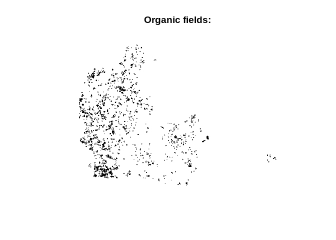
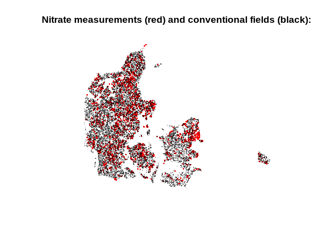

groundwater\_pollution\_dk
================
Johan Horsmans
4/26/2021

``` r
library(pacman)

p_load(sf, raster, dplyr, tmap, ggplot2, tidyverse, lubridate, sp, gstat)
```

``` r
nitrate <- as.data.frame(read_csv("data/nitrate.csv")) #Load the .csv-file as a dataframe and save it as "nitrate".
```

    ## 
    ## ── Column specification ────────────────────────────────────────────────────────
    ## cols(
    ##   WKT = col_character(),
    ##   `Vis data` = col_character(),
    ##   DGUnr. = col_character(),
    ##   Borerapport = col_character(),
    ##   Indtag = col_double(),
    ##   Analyser = col_double(),
    ##   `Median mg/l` = col_double(),
    ##   `Min. mg/l` = col_double(),
    ##   `Maks. mg/l` = col_double(),
    ##   `Indtag topdybde` = col_double(),
    ##   `Topdybde forklaret` = col_character(),
    ##   Seneste = col_date(format = ""),
    ##   `Seneste mg/l` = col_double(),
    ##   objectid = col_double(),
    ##   symbol_ident = col_character(),
    ##   symbol_size = col_double(),
    ##   symbol_txt_size = col_double(),
    ##   txt_search = col_character(),
    ##   rgb = col_character()
    ## )

``` r
#Rename columns to remove spaces:
names(nitrate)[names(nitrate) == "Seneste"] <- "Seneste_måling" 
names(nitrate)[names(nitrate) == "Seneste mg/l"] <- "Seneste_mgl"
```

Remove outliers

``` r
nitrate <- nitrate %>%
  filter_at(vars("Seneste_mgl"), any_vars(. < 200))
```

Processing the nitrate.csv-file into a compatible format.

``` r
nitrate$WKT <- as.character(nitrate$WKT)
nitrate$WKT <- gsub("POINT \\(", "", nitrate$WKT)
nitrate$WKT <- gsub(")", "", nitrate$WKT)
```

Separate into two columns

``` r
nitrate <- nitrate %>% 
  separate(col = WKT, into = c("longitude","latitude"), sep = " ")
```

Making it a shapefile

``` r
nitrate <- st_as_sf(nitrate, coords = c("longitude", "latitude"))
```

``` r
markblok<-st_read("data/Markblok.shp") %>% na.omit()
```

    ## Reading layer `Markblok' from data source `/home/cds-au618771/cds-spatial/groundwater_polution_dk/data/Markblok.shp' using driver `ESRI Shapefile'
    ## replacing null geometries with empty geometries
    ## Simple feature collection with 476658 features and 6 fields (with 1 geometry empty)
    ## geometry type:  POLYGON
    ## dimension:      XY
    ## bbox:           xmin: 442061.7 ymin: 6049864 xmax: 892661.5 ymax: 6401571
    ## proj4string:    +proj=utm +zone=32 +ellps=GRS80 +units=m +no_defs

``` r
okologimark<-st_read("data/Oekologiske_arealer_2019.shp") %>% na.omit()
```

    ## Reading layer `Oekologiske_arealer_2019' from data source `/home/cds-au618771/cds-spatial/groundwater_polution_dk/data/Oekologiske_arealer_2019.shp' using driver `ESRI Shapefile'
    ## Simple feature collection with 80218 features and 6 fields
    ## geometry type:  POLYGON
    ## dimension:      XY
    ## bbox:           xmin: 442061.7 ymin: 6050576 xmax: 891705.8 ymax: 6398325
    ## proj4string:    +proj=utm +zone=32 +ellps=GRS80 +units=m +no_defs

``` r
head(markblok)
```

    ## Simple feature collection with 6 features and 6 fields
    ## geometry type:  POLYGON
    ## dimension:      XY
    ## bbox:           xmin: 453275.5 ymin: 6094145 xmax: 555429.2 ymax: 6243069
    ## proj4string:    +proj=utm +zone=32 +ellps=GRS80 +units=m +no_defs 
    ##      BLOKNR  ORTOAAR MODSTORTO BRUTTOAREA TARAAREAL BLOKTYPE
    ## 2 480178-34     2017         N      15.89         0      OMD
    ## 3 555243-81 SOP 2018         N       1.00         0      PGR
    ## 4 542094-82 SOP 2018         N       1.05         0      PGR
    ## 5 537145-26     2018         N       6.67         0      OMD
    ## 6 508213-72     2018         N       5.22         0      OMD
    ## 7 453161-37 SOP 2018         N       2.10         0      OMD
    ##                         geometry
    ## 2 POLYGON ((480012.5 6178057,...
    ## 3 POLYGON ((555298.4 6243005,...
    ## 4 POLYGON ((542803.8 6094182,...
    ## 5 POLYGON ((536933.1 6145424,...
    ## 6 POLYGON ((508505.5 6212914,...
    ## 7 POLYGON ((453275.5 6161741,...

``` r
head(okologimark)
```

    ## Simple feature collection with 6 features and 6 fields
    ## geometry type:  POLYGON
    ## dimension:      XY
    ## bbox:           xmin: 585547.5 ymin: 6209806 xmax: 716017.1 ymax: 6240422
    ## proj4string:    +proj=utm +zone=32 +ellps=GRS80 +units=m +no_defs 
    ##      Marknr Afmeldings  Journalnr AutNR_Iden Omlaegning OML
    ## 1       1-0 2019-09-01 19-0042610    1102304 1999-10-01   1
    ## 2      10-0 2019-09-01 19-0042610    1102304 1999-10-01   1
    ## 3       3-0 2019-09-01 19-0042610    1102304 1999-10-01   1
    ## 4       1-1 2019-09-01 19-0042610    1102304 2016-04-19   1
    ## 2031     24 2019-07-05 19-0002394     887779 1999-09-01   1
    ## 2032     22 2019-07-05 19-0002394     887779 1999-09-01   1
    ##                            geometry
    ## 1    POLYGON ((715557.6 6209971,...
    ## 2    POLYGON ((715774.1 6209897,...
    ## 3    POLYGON ((715706.4 6209942,...
    ## 4    POLYGON ((715438.6 6209932,...
    ## 2031 POLYGON ((585699.9 6240201,...
    ## 2032 POLYGON ((585864.4 6240098,...

``` r
head(nitrate)
```

    ## Simple feature collection with 6 features and 18 fields
    ## geometry type:  POINT
    ## dimension:      XY
    ## bbox:           xmin: 475687 ymin: 6095070 xmax: 707352 ymax: 6377856
    ## CRS:            NA
    ##                                                        Vis data    DGUnr.
    ## 1 http://data.geus.dk/JupiterWWW/proeve.jsp?proeveid=2008094446   5.  921
    ## 2 http://data.geus.dk/JupiterWWW/proeve.jsp?proeveid=2020051024 132. 2480
    ## 3 http://data.geus.dk/JupiterWWW/proeve.jsp?proeveid=2018025191 200. 9609
    ## 4 http://data.geus.dk/JupiterWWW/proeve.jsp?proeveid=2019018210  94. 2838
    ## 5 http://data.geus.dk/JupiterWWW/proeve.jsp?proeveid=1996010161 233.   10
    ## 6 http://data.geus.dk/JupiterWWW/proeve.jsp?proeveid=2006386596 217.  510
    ##                                                     Borerapport Indtag Analyser
    ## 1    http://data.geus.dk/JupiterWWW/borerapport.jsp?dgunr=5.921      1        1
    ## 2 http://data.geus.dk/JupiterWWW/borerapport.jsp?dgunr=132.2480     NA        1
    ## 3 http://data.geus.dk/JupiterWWW/borerapport.jsp?dgunr=200.9609      1        1
    ## 4  http://data.geus.dk/JupiterWWW/borerapport.jsp?dgunr=94.2838      1        1
    ## 5   http://data.geus.dk/JupiterWWW/borerapport.jsp?dgunr=233.10      1        1
    ## 6  http://data.geus.dk/JupiterWWW/borerapport.jsp?dgunr=217.510      1        1
    ##   Median mg/l Min. mg/l Maks. mg/l Indtag topdybde
    ## 1           2         2          2             2.0
    ## 2           2         2          2             4.0
    ## 3           2         2          2             1.0
    ## 4           2         2          2            55.0
    ## 5           2         2          2            36.0
    ## 6           2         2          2            21.1
    ##              Topdybde forklaret Seneste_måling Seneste_mgl   objectid
    ## 1              Dybdetop anvendt     1989-06-01           2 2008094446
    ## 2 Boringdybde minus 2 m anvendt     1997-09-16           2 2020051024
    ## 3              Dybdetop anvendt     2016-10-31           2 2018025191
    ## 4              Dybdetop anvendt     2019-09-25           2 2019018210
    ## 5              Dybdetop anvendt     1995-06-12           2 1996010161
    ## 6              Dybdetop anvendt     1968-03-12           2 2006386596
    ##   symbol_ident symbol_size symbol_txt_size txt_search     rgb
    ## 1         NUM5          12               7    5.  921 0 255 0
    ## 2         NUM5          12               7  132. 2480 0 255 0
    ## 3         NUM3          12               7  200. 9609 0 255 0
    ## 4         NUM2          22              11   94. 2838 0 255 0
    ## 5         NUM5          19              10  233.   10 0 255 0
    ## 6         NUM5          16               9  217.  510 0 255 0
    ##                 geometry
    ## 1 POINT (557818 6377856)
    ## 2 POINT (508877 6148371)
    ## 3 POINT (701255 6174649)
    ## 4 POINT (475687 6208449)
    ## 5 POINT (707352 6095070)
    ## 6 POINT (690302 6134155)

# Plotting fields

``` r
plot(st_geometry(okologimark))
```

<!-- -->

``` r
plot(st_geometry(markblok))
```

<!-- -->

Setting CRS

``` r
# Set the projection of the nitrate data as EPSG 25832
nitrate <- st_set_crs(nitrate, value = 25832)
okologimark <- st_set_crs(okologimark, value = 25832)
markblok <- st_set_crs(markblok, value = 25832)
```

    ## Warning: st_crs<- : replacing crs does not reproject data; use st_transform for
    ## that

``` r
# Transform the geometry of the data to the assigned CRS. 
nitrate <- st_transform(nitrate, crs=25832)
markblok <- st_transform(markblok, crs=25832)
okologimark <- st_transform(okologimark, crs = 25832)

# Verify the projection is 'projected' not 'geographic'
head(nitrate) 
```

    ## Simple feature collection with 6 features and 18 fields
    ## geometry type:  POINT
    ## dimension:      XY
    ## bbox:           xmin: 475687 ymin: 6095070 xmax: 707352 ymax: 6377856
    ## CRS:            EPSG:25832
    ##                                                        Vis data    DGUnr.
    ## 1 http://data.geus.dk/JupiterWWW/proeve.jsp?proeveid=2008094446   5.  921
    ## 2 http://data.geus.dk/JupiterWWW/proeve.jsp?proeveid=2020051024 132. 2480
    ## 3 http://data.geus.dk/JupiterWWW/proeve.jsp?proeveid=2018025191 200. 9609
    ## 4 http://data.geus.dk/JupiterWWW/proeve.jsp?proeveid=2019018210  94. 2838
    ## 5 http://data.geus.dk/JupiterWWW/proeve.jsp?proeveid=1996010161 233.   10
    ## 6 http://data.geus.dk/JupiterWWW/proeve.jsp?proeveid=2006386596 217.  510
    ##                                                     Borerapport Indtag Analyser
    ## 1    http://data.geus.dk/JupiterWWW/borerapport.jsp?dgunr=5.921      1        1
    ## 2 http://data.geus.dk/JupiterWWW/borerapport.jsp?dgunr=132.2480     NA        1
    ## 3 http://data.geus.dk/JupiterWWW/borerapport.jsp?dgunr=200.9609      1        1
    ## 4  http://data.geus.dk/JupiterWWW/borerapport.jsp?dgunr=94.2838      1        1
    ## 5   http://data.geus.dk/JupiterWWW/borerapport.jsp?dgunr=233.10      1        1
    ## 6  http://data.geus.dk/JupiterWWW/borerapport.jsp?dgunr=217.510      1        1
    ##   Median mg/l Min. mg/l Maks. mg/l Indtag topdybde
    ## 1           2         2          2             2.0
    ## 2           2         2          2             4.0
    ## 3           2         2          2             1.0
    ## 4           2         2          2            55.0
    ## 5           2         2          2            36.0
    ## 6           2         2          2            21.1
    ##              Topdybde forklaret Seneste_måling Seneste_mgl   objectid
    ## 1              Dybdetop anvendt     1989-06-01           2 2008094446
    ## 2 Boringdybde minus 2 m anvendt     1997-09-16           2 2020051024
    ## 3              Dybdetop anvendt     2016-10-31           2 2018025191
    ## 4              Dybdetop anvendt     2019-09-25           2 2019018210
    ## 5              Dybdetop anvendt     1995-06-12           2 1996010161
    ## 6              Dybdetop anvendt     1968-03-12           2 2006386596
    ##   symbol_ident symbol_size symbol_txt_size txt_search     rgb
    ## 1         NUM5          12               7    5.  921 0 255 0
    ## 2         NUM5          12               7  132. 2480 0 255 0
    ## 3         NUM3          12               7  200. 9609 0 255 0
    ## 4         NUM2          22              11   94. 2838 0 255 0
    ## 5         NUM5          19              10  233.   10 0 255 0
    ## 6         NUM5          16               9  217.  510 0 255 0
    ##                 geometry
    ## 1 POINT (557818 6377856)
    ## 2 POINT (508877 6148371)
    ## 3 POINT (701255 6174649)
    ## 4 POINT (475687 6208449)
    ## 5 POINT (707352 6095070)
    ## 6 POINT (690302 6134155)

``` r
head(markblok)
```

    ## Simple feature collection with 6 features and 6 fields
    ## geometry type:  POLYGON
    ## dimension:      XY
    ## bbox:           xmin: 453275.5 ymin: 6094145 xmax: 555429.2 ymax: 6243069
    ## CRS:            EPSG:25832
    ##      BLOKNR  ORTOAAR MODSTORTO BRUTTOAREA TARAAREAL BLOKTYPE
    ## 2 480178-34     2017         N      15.89         0      OMD
    ## 3 555243-81 SOP 2018         N       1.00         0      PGR
    ## 4 542094-82 SOP 2018         N       1.05         0      PGR
    ## 5 537145-26     2018         N       6.67         0      OMD
    ## 6 508213-72     2018         N       5.22         0      OMD
    ## 7 453161-37 SOP 2018         N       2.10         0      OMD
    ##                         geometry
    ## 2 POLYGON ((480012.5 6178057,...
    ## 3 POLYGON ((555298.4 6243005,...
    ## 4 POLYGON ((542803.8 6094182,...
    ## 5 POLYGON ((536933.1 6145424,...
    ## 6 POLYGON ((508505.5 6212914,...
    ## 7 POLYGON ((453275.5 6161741,...

``` r
head(okologimark)
```

    ## Simple feature collection with 6 features and 6 fields
    ## geometry type:  POLYGON
    ## dimension:      XY
    ## bbox:           xmin: 585547.5 ymin: 6209806 xmax: 716017.1 ymax: 6240422
    ## CRS:            EPSG:25832
    ##      Marknr Afmeldings  Journalnr AutNR_Iden Omlaegning OML
    ## 1       1-0 2019-09-01 19-0042610    1102304 1999-10-01   1
    ## 2      10-0 2019-09-01 19-0042610    1102304 1999-10-01   1
    ## 3       3-0 2019-09-01 19-0042610    1102304 1999-10-01   1
    ## 4       1-1 2019-09-01 19-0042610    1102304 2016-04-19   1
    ## 2031     24 2019-07-05 19-0002394     887779 1999-09-01   1
    ## 2032     22 2019-07-05 19-0002394     887779 1999-09-01   1
    ##                            geometry
    ## 1    POLYGON ((715557.6 6209971,...
    ## 2    POLYGON ((715774.1 6209897,...
    ## 3    POLYGON ((715706.4 6209942,...
    ## 4    POLYGON ((715438.6 6209932,...
    ## 2031 POLYGON ((585699.9 6240201,...
    ## 2032 POLYGON ((585864.4 6240098,...

Filtering dates between 2018 and 2021:

``` r
nitrate <- nitrate %>%
 select(Seneste_måling, Seneste_mgl, geometry, `Indtag topdybde`) %>%
 filter(Seneste_måling >= as.Date("2018-01-01") & Seneste_måling <= as.Date("2021-03-10"))
```

Remove duplicate entries (for the purpose of kriging)

``` r
nitrate<-nitrate[!duplicated(nitrate$geometry), ]
```

Plotting the points

``` r
plot(st_geometry(nitrate), pch = 16, cex = 0.4)
```

<!-- -->

Plotting points on top of organic fields (to assess CRS allignment)

``` r
plot(st_geometry(nitrate), pch = 16, cex = 0.4, col = "red")
plot(st_geometry(okologimark), add = TRUE)
```

<!-- -->

Plotting points on top of all fields (to assess CRS allignment)

``` r
plot(st_geometry(markblok))
plot(st_geometry(nitrate), add = TRUE, pch = 16, cex = 0.4, col = "red")
```

<!-- -->

\#Exploratory statistics:

Depth:

``` r
summary(nitrate$`Indtag topdybde`)
```

    ##    Min. 1st Qu.  Median    Mean 3rd Qu.    Max. 
    ##   -2.00    8.50   17.40   22.69   31.00  179.00

``` r
sd(nitrate$`Indtag topdybde`)
```

    ## [1] 19.42962

Nitrate:

``` r
summary(nitrate$Seneste_mgl)
```

    ##    Min. 1st Qu.  Median    Mean 3rd Qu.    Max. 
    ##    2.00    6.60   18.00   25.69   36.00  190.40

``` r
hist(nitrate$Seneste_mgl)
```

<!-- -->

Plotting points with nitrate per. mg/l metric:

``` r
ggplot(nitrate) +
  geom_sf(aes(col = Seneste_mgl))
```

<!-- -->

# Kriging:

Creating X- and Y-value columns

``` r
nitrate$X <- st_coordinates(nitrate)[,1]
nitrate$Y <- st_coordinates(nitrate)[,2]
```

Make variogram by fitting X- and Y coordinates to nitrate mg/l with a
linear regression

``` r
vgm <- variogram(nitrate$Seneste_mgl ~ X + Y, nitrate)
plot(vgm)
```

<!-- -->

ADELAS TEXT: “You might imagine that if soil at a particular point is
nutrient-rich, then soil one metre away is likely to be fertile too. But
can you say the same thing about soil one kilometre away, or ten
kilometres, or one hundred kilometres?”

JOHANS TEXT: “It appears that it is very hard to find spatial
correlations in the data. Nonetheles, it appears that the first 30000
(units) are more correlated than those further away. As such, we argue
that this model can be used for kriging, since it only needs to
interpolate data that is close to”real" data".

Fit a model to the variogram:

``` r
# Eyeball the variogram and estimate the initial parameters (ADELA TEXT)
nugget <- 550
psill <- -360
range <- 45000
# Fit the variogram (ADELA TEXT)
v_model <- fit.variogram(
  vgm, 
  model = vgm(
    model = "Ste",
    nugget = nugget,
    psill = psill,
    range = range,
    kappa = 0.5
  )
)
# Show the fitted variogram on top of the binned variogram (ADELA TEXT)
plot(vgm, model = v_model)
```

<!-- -->

``` r
print(v_model)
```

    ##   model    psill    range kappa
    ## 1   Nug 466.3852     0.00   0.0
    ## 2   Ste 335.4143 55950.65   0.5

# Create prediction grid (ALL COMMENTING IS ADELA)

``` r
# Create geo_bounds bounding box for kaz_geo 
geo_bounds <- st_make_grid(nitrate$geometry, n=1)
# Plot the bounding box polygon and points
plot(nitrate$geometry); plot(geo_bounds, add= TRUE) 
```

<!-- -->

``` r
# Find the left bottom corner of the bounding box
st_bbox(nitrate)
```

    ##    xmin    ymin    xmax    ymax 
    ##  449314 6064054  885215 6397594

``` r
# Define a 0.5km square grid over the polygon extent. The first parameter is the bottom left corner.

grid <- GridTopology(c(446734,6054448), c(2000, 2000), c(222, 173))
# Create points with the same coordinate system as the boundary box
crs(nitrate)
```

    ## CRS arguments:
    ##  +proj=utm +zone=32 +ellps=GRS80 +towgs84=0,0,0,0,0,0,0 +units=m
    ## +no_defs

``` r
gridpoints <- SpatialPoints(grid, proj4string = CRS(projection("+proj=utm +zone=32 +ellps=GRS80 +towgs84=0,0,0,0,0,0,0 +units=m +no_defs "))) # CHECK CRS

#UNIQUE
#the_crs <- crs(nitrate, asText = TRUE)
#gridpoints <- st_set_crs(gridpoints, the_crs) # Project the "zion"-dataset into the srtm-crs and save it as "zion2".
#### UNIQUE END

plot(gridpoints); plot(geo_bounds, col = "red", add = TRUE)
```

<!-- -->

``` r
# Crop out the points outside the boundary
cropped_gridpoints <- crop(gridpoints, as(geo_bounds, "Spatial"))
plot(cropped_gridpoints);  plot(geo_bounds, col = "red", add = TRUE)
```

<!-- -->

``` r
# Convert to SpatialPixels
spgrid <- SpatialPixels(cropped_gridpoints)
coordnames(spgrid) <- c("X", "Y")
plot(spgrid)
```

<!-- -->

# Using fitted variogram model to interpolate new data to the grid

ADELA: “Use the spatial pixel grid of the region, `spgrid`, and the
variogram model of OM, `v_model` from previous exercises.”

``` r
# Adjust the kaz_geo CRS to be consistent with spgrid
crs(as(nitrate, "Spatial"), asText = TRUE) == crs(spgrid, asText = TRUE)
```

    ## [1] TRUE

``` r
# Despite the statement above krige() is erroring out due to CRS misalignment, so forcing it here:
nitrate_sp <- as(nitrate, "Spatial")
crs(nitrate_sp) <- crs(spgrid)
# Do kriging predictions over the grid
nitrate_grid <- krige(Seneste_mgl ~ X + Y, nitrate_sp, newdata = spgrid, model = v_model)
```

    ## [using universal kriging]

``` r
# Plot the soil-nutrient predictions in a grid


#UNIQUE:
#Plotting raster:
tm_shape(nitrate_grid[1])  +
  tm_raster(title = "Nitrate mg/l", 
            style = "cont",
            palette = "-RdYlGn") +
  tm_credits(text = "Johan Horsmans & Emil Jessen") +
  tm_layout(main.title = "Nitrate pollution map")
```

<!-- -->

``` r
#Points overlayed on raster:
tm_shape(nitrate_grid[1])  +
  tm_raster(title = "Nitrate mg/l", 
            style = "cont",
            palette = "-RdYlGn") +
tm_shape(nitrate) +
  tm_dots()
```

<!-- -->

``` r
###
```
