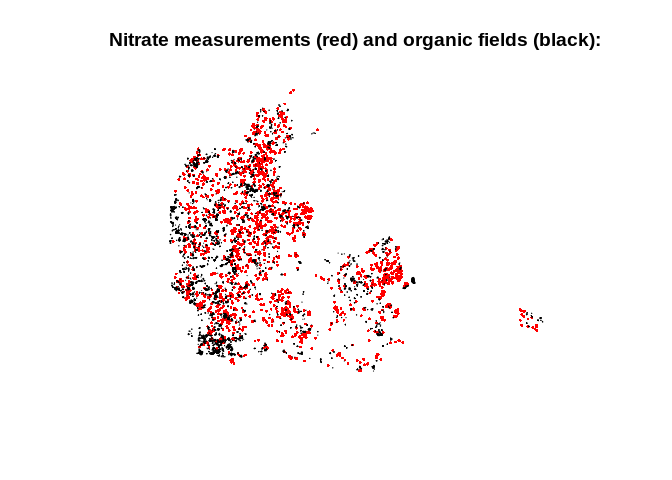
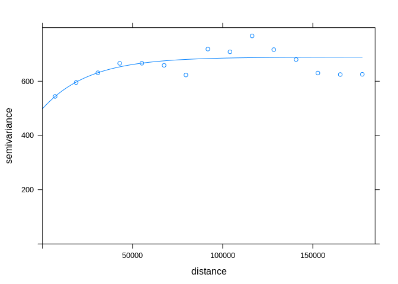

groundwater\_pollution\_dk
================
Johan Horsmans
05/06/2021

# Loading- and preprocessing data:

### Loading packages

``` r
library(pacman)
p_load(sf, raster, dplyr, tmap, ggplot2, tidyverse, lubridate, sp, gstat, ggthemes, lmtest)
```

### Loading nitrate data:

``` r
# Load the .csv-file as a dataframe and save it as "nitrate":
nitrate <- as.data.frame(read_csv("data/nitrate.csv")) 
```

    ## Parsed with column specification:
    ## cols(
    ##   WKT = col_character(),
    ##   `Vis data` = col_character(),
    ##   DGUnr. = col_character(),
    ##   Borerapport = col_character(),
    ##   Indtag = col_double(),
    ##   Analyser = col_double(),
    ##   `Median mg/l` = col_double(),
    ##   `Min. mg/l` = col_double(),
    ##   `Maks. mg/l` = col_double(),
    ##   `Indtag topdybde` = col_double(),
    ##   `Topdybde forklaret` = col_character(),
    ##   Seneste = col_date(format = ""),
    ##   `Seneste mg/l` = col_double(),
    ##   objectid = col_double(),
    ##   symbol_ident = col_character(),
    ##   symbol_size = col_double(),
    ##   symbol_txt_size = col_double(),
    ##   txt_search = col_character(),
    ##   rgb = col_character()
    ## )

``` r
# Rename columns to remove spaces and odd characters:
names(nitrate)[names(nitrate) == "Seneste"] <- "measurement_date" 
names(nitrate)[names(nitrate) == "Seneste mg/l"] <- "nitrate_concentration"
names(nitrate)[names(nitrate) == "Indtag topdybde"] <- "measurement_depth" 
```

### Remove outliers (see written report for more info):

``` r
# Remove all nitrate measures with a nitrate concentration above 200 mg/L:
nitrate <- nitrate %>%
  filter_at(vars("nitrate_concentration"), any_vars(. < 200))

# Remove all nitrate-measures with a measurement depth below 0 (i.e. above ground level):
nitrate <- nitrate %>%
  filter_at(vars("measurement_depth"), any_vars(. > 0))
```

### Processing the nitrate-dataframe to make it compatible with shapefile-format:

``` r
# Transform coordinate column to characters:
nitrate$WKT <- as.character(nitrate$WKT)

# Use Regex to remove non-coordinate characters:
nitrate$WKT <- gsub("POINT \\(", "", nitrate$WKT)
nitrate$WKT <- gsub(")", "", nitrate$WKT)
```

### Separate coordinates into two columns:

``` r
# Separate the longitude- and latitude coordinates into separate columns. The coordinates are separated by space (i.e. " "):
nitrate <- nitrate %>% 
  separate(col = WKT, into = c("longitude","latitude"), sep = " ") 
```

### Making it an sf-object:

``` r
nitrate <- st_as_sf(nitrate, coords = c("longitude", "latitude"))
```

Setting CRS (for more info, see written report):

``` r
# Set the projection of the nitrate data as EPSG 25832:
nitrate <- st_set_crs(nitrate, value = 25832)

# Transform the geometry of the data to the assigned CRS:
nitrate <- st_transform(nitrate, crs=25832)

# Verify the data has been assigned new CRS:
st_crs(nitrate)[1]
```

    ## $input
    ## [1] "EPSG:25832"

### Filtering dates between 2012 and 2021:

``` r
nitrate <- nitrate %>%
 select(measurement_date, nitrate_concentration, geometry, measurement_depth) %>%
 filter(measurement_date >= as.Date("2012-01-01") & measurement_date <= as.Date("2021-03-10"))
```

### Remove duplicate entries:

``` r
nitrate <- nitrate[!duplicated(nitrate$geometry), ]
```

### Inspecting “nitrate”:

``` r
head(nitrate)
```

    ## Simple feature collection with 6 features and 3 fields
    ## geometry type:  POINT
    ## dimension:      XY
    ## bbox:           xmin: 475687 ymin: 6118543 xmax: 866691 ymax: 6208449
    ## projected CRS:  ETRS89 / UTM zone 32N
    ##   measurement_date nitrate_concentration measurement_depth
    ## 1       2016-10-31                     2               1.0
    ## 2       2019-09-25                     2              55.0
    ## 3       2013-02-19                     2              90.0
    ## 4       2018-09-20                     2              49.7
    ## 5       2019-03-26                     2              22.0
    ## 6       2013-08-28                     2              15.0
    ##                 geometry
    ## 1 POINT (701255 6174649)
    ## 2 POINT (475687 6208449)
    ## 3 POINT (519707 6147841)
    ## 4 POINT (704411 6141276)
    ## 5 POINT (713490 6193519)
    ## 6 POINT (866691 6118543)

### Plotting points with nitrate per. mg/l metric:

``` r
ggplot(nitrate, aes(colour = nitrate_concentration)) +
  geom_sf() + coord_sf(datum = st_crs(25832)) + theme_solarized() + labs(title = "Nitrate measurements:", color = "Nitrate (mg/L)") + scale_colour_gradientn(colors = c("darkgreen", "yellow", "red")) + xlab("Metres") + ylab("Metres")
```

<!-- -->

### Loading land-use data:

``` r
# Loading "Markblok.shp" which contains all registered fields in Denmark and set CRS as EPSG 25832:
all_fields <- st_read("data/Markblok.shp") %>% na.omit() %>% st_transform(25832)
```

    ## Reading layer `Markblok' from data source `C:\Users\horsm\Desktop\Cultural Data Science\groundwater_pollution_dk\data\Markblok.shp' using driver `ESRI Shapefile'
    ## replacing null geometries with empty geometries
    ## Simple feature collection with 476658 features and 6 fields (with 1 geometry empty)
    ## geometry type:  POLYGON
    ## dimension:      XY
    ## bbox:           xmin: 442061.7 ymin: 6049864 xmax: 892661.5 ymax: 6401571
    ## projected CRS:  ETRS89_UTM_zone_32N

``` r
# Convert "fields" to SpatialPolygons-object:
all_fields <- as_Spatial(all_fields$geometry)
```

    ## Warning in showSRID(uprojargs, format = "PROJ", multiline = "NO", prefer_proj
    ## = prefer_proj): Discarded datum Unknown based on GRS80 ellipsoid in Proj4
    ## definition

    ## Warning in showSRID(SRS_string, format = "PROJ", multiline = "NO", prefer_proj
    ## = prefer_proj): Discarded datum European Terrestrial Reference System 1989 in
    ## Proj4 definition

``` r
# Load all registered ecological fields (from 2012 to 2020) and set CRS as EPSG 25832::
organic_fields_2012 <- st_read("data/Oekologiske_arealer_2012.shp") %>% na.omit() %>% st_transform(25832)
```

    ## Reading layer `Oekologiske_arealer_2012' from data source `C:\Users\horsm\Desktop\Cultural Data Science\groundwater_pollution_dk\data\Oekologiske_arealer_2012.shp' using driver `ESRI Shapefile'
    ## Simple feature collection with 49904 features and 5 fields
    ## geometry type:  POLYGON
    ## dimension:      XY
    ## bbox:           xmin: 445062.9 ymin: 6050575 xmax: 891630.3 ymax: 6391823
    ## projected CRS:  ETRS89 / UTM zone 32N

``` r
organic_fields_2013 <- st_read("data/Oekologiske_arealer_2013.shp") %>% na.omit() %>% st_transform(25832)
```

    ## Reading layer `Oekologiske_arealer_2013' from data source `C:\Users\horsm\Desktop\Cultural Data Science\groundwater_pollution_dk\data\Oekologiske_arealer_2013.shp' using driver `ESRI Shapefile'
    ## Simple feature collection with 49326 features and 5 fields
    ## geometry type:  POLYGON
    ## dimension:      XY
    ## bbox:           xmin: 445063.1 ymin: 6050575 xmax: 892019.1 ymax: 6391818
    ## projected CRS:  ETRS89 / UTM zone 32N

``` r
organic_fields_2014 <- st_read("data/Oekologiske_arealer_2014.shp") %>% na.omit() %>% st_transform(25832)
```

    ## Reading layer `Oekologiske_arealer_2014' from data source `C:\Users\horsm\Desktop\Cultural Data Science\groundwater_pollution_dk\data\Oekologiske_arealer_2014.shp' using driver `ESRI Shapefile'
    ## Simple feature collection with 47797 features and 5 fields
    ## geometry type:  POLYGON
    ## dimension:      XY
    ## bbox:           xmin: 445063.1 ymin: 6050576 xmax: 892019.6 ymax: 6391818
    ## projected CRS:  ETRS89 / UTM zone 32N

``` r
organic_fields_2015 <- st_read("data/Oekologiske_arealer_2015.shp") %>% na.omit() %>% st_transform(25832)
```

    ## Reading layer `Oekologiske_arealer_2015' from data source `C:\Users\horsm\Desktop\Cultural Data Science\groundwater_pollution_dk\data\Oekologiske_arealer_2015.shp' using driver `ESRI Shapefile'
    ## Simple feature collection with 48803 features and 5 fields
    ## geometry type:  POLYGON
    ## dimension:      XY
    ## bbox:           xmin: 445063.1 ymin: 6050576 xmax: 892017.4 ymax: 6391818
    ## projected CRS:  ETRS89 / UTM zone 32N

``` r
organic_fields_2016 <- st_read("data/Oekologiske_arealer_2016.shp") %>% na.omit() %>% st_transform(25832)
```

    ## Reading layer `Oekologiske_arealer_2016' from data source `C:\Users\horsm\Desktop\Cultural Data Science\groundwater_pollution_dk\data\Oekologiske_arealer_2016.shp' using driver `ESRI Shapefile'
    ## Simple feature collection with 59376 features and 5 fields
    ## geometry type:  POLYGON
    ## dimension:      XY
    ## bbox:           xmin: 444745.7 ymin: 6050576 xmax: 892017.4 ymax: 6392806
    ## projected CRS:  ETRS89 / UTM zone 32N

``` r
organic_fields_2017 <- st_read("data/Oekologiske_arealer_2017.shp") %>% na.omit() %>% st_transform(25832)
```

    ## Reading layer `Oekologiske_arealer_2017' from data source `C:\Users\horsm\Desktop\Cultural Data Science\groundwater_pollution_dk\data\Oekologiske_arealer_2017.shp' using driver `ESRI Shapefile'
    ## Simple feature collection with 66344 features and 5 fields
    ## geometry type:  POLYGON
    ## dimension:      XY
    ## bbox:           xmin: 442061.7 ymin: 6050576 xmax: 892017.4 ymax: 6398325
    ## projected CRS:  ETRS89 / UTM zone 32N

``` r
organic_fields_2018 <- st_read("data/Oekologiske_arealer_2018.shp") %>% na.omit() %>% st_transform(25832)
```

    ## Reading layer `Oekologiske_arealer_2018' from data source `C:\Users\horsm\Desktop\Cultural Data Science\groundwater_pollution_dk\data\Oekologiske_arealer_2018.shp' using driver `ESRI Shapefile'
    ## Simple feature collection with 74446 features and 6 fields
    ## geometry type:  POLYGON
    ## dimension:      XY
    ## bbox:           xmin: 442061.7 ymin: 6050576 xmax: 891630.3 ymax: 6398325
    ## projected CRS:  ETRS89 / UTM zone 32N

``` r
organic_fields_2019 <- st_read("data/Oekologiske_arealer_2019.shp") %>% na.omit() %>% st_transform(25832)
```

    ## Reading layer `Oekologiske_arealer_2019' from data source `C:\Users\horsm\Desktop\Cultural Data Science\groundwater_pollution_dk\data\Oekologiske_arealer_2019.shp' using driver `ESRI Shapefile'
    ## Simple feature collection with 80218 features and 6 fields
    ## geometry type:  POLYGON
    ## dimension:      XY
    ## bbox:           xmin: 442061.7 ymin: 6050576 xmax: 891705.8 ymax: 6398325
    ## projected CRS:  ETRS89 / UTM zone 32N

``` r
organic_fields_2020 <- st_read("data/Oekologiske_arealer_2020.shp") %>% na.omit() %>% st_transform(25832)
```

    ## Reading layer `Oekologiske_arealer_2020' from data source `C:\Users\horsm\Desktop\Cultural Data Science\groundwater_pollution_dk\data\Oekologiske_arealer_2020.shp' using driver `ESRI Shapefile'
    ## Simple feature collection with 80916 features and 6 fields
    ## geometry type:  POLYGON
    ## dimension:      XY
    ## bbox:           xmin: 442061.7 ymin: 6050576 xmax: 892069.6 ymax: 6401475
    ## projected CRS:  ETRS89 / UTM zone 32N

``` r
# Merge organic field-geometries as "organic_fields":
organic_fields <- c(organic_fields_2012$geometry, organic_fields_2013$geometry, organic_fields_2014$geometry, organic_fields_2015$geometry, organic_fields_2016$geometry, organic_fields_2017$geometry, organic_fields_2018$geometry, organic_fields_2019$geometry, organic_fields_2020$geometry)

# Convert "organic_fields" to SpatialPolygons-object:
organic_fields <- as_Spatial(organic_fields)
```

    ## Warning in showSRID(uprojargs, format = "PROJ", multiline = "NO", prefer_proj
    ## = prefer_proj): Discarded datum Unknown based on GRS80 ellipsoid in Proj4
    ## definition
    
    ## Warning in showSRID(uprojargs, format = "PROJ", multiline = "NO", prefer_proj
    ## = prefer_proj): Discarded datum European Terrestrial Reference System 1989 in
    ## Proj4 definition

``` r
# Make a new variable called "conventional_fields", where all polygons in "all_fields" that overlap with the polygons in "organic_fields" are removed:
conventional_fields <- all_fields[lengths(st_intersects(st_as_sf(all_fields),st_as_sf(organic_fields)))==0,]

# Assess how many organic fields have been filtered out:
length(all_fields) - length(conventional_fields)
```

    ## [1] 9756

9756 organic fields have been filtered out. In summary, we have now
loaded all nitrate-measurements between 2012 and 2021 and all current
organic- and conventional fields.

### Inspecting “conventional\_fields” and “organic\_fields”:

``` r
# Inspect "conventional_fields" and "organic_fields":
head(conventional_fields)
```

    ## class       : SpatialPolygons 
    ## features    : 1 
    ## extent      : 480012.5, 480504.3, 6177890, 6178556  (xmin, xmax, ymin, ymax)
    ## crs         : +proj=utm +zone=32 +ellps=GRS80 +units=m +no_defs

``` r
head(organic_fields)
```

    ## class       : SpatialPolygons 
    ## features    : 1 
    ## extent      : 530727.8, 530839.2, 6288276, 6288385  (xmin, xmax, ymin, ymax)
    ## crs         : +proj=utm +zone=32 +ellps=GRS80 +units=m +no_defs

### Plotting fields:

``` r
# Plot organic fields:
plot(organic_fields, main = "Organic fields:")
```

<!-- -->

``` r
# Plot conventional fields:
plot(conventional_fields, main = "Conventional fields:")
```

<!-- -->

### Taking subset of conventional fields to reduce computational load (see written report for more info):

``` r
# Subsetting "conventional_fields" to make it contain as many polygons as "organic_fields":
conventional_fields <- sample(conventional_fields, length(organic_fields))
```

### Plotting nitrate measurement-points on top of organic fields (to assess CRS allignment):

``` r
plot(st_geometry(nitrate), pch = 16, cex = 0.4, col = "red", main = "Nitrate measurements (red) and organic fields (black):")
plot(organic_fields, add = TRUE)
```

<!-- -->

### Plotting points on top of all conventional fields (to assess CRS allignment):

``` r
plot(st_geometry(nitrate), pch = 16, cex = 0.4, col = "red", main = "Nitrate measurements (red) and conventional fields (black):")
plot(conventional_fields, add = TRUE)
```

<!-- -->

# Exploratory statistics:

## The following sections is designed to create a plot with depth distributions for nitrate measurements carried out on conventional- and organic fields, respectively (see written report for more info).

### Creating a variable with conventional polygons in list-format:

``` r
conventional_polygon_list <- lapply(conventional_fields@polygons, function(x) SpatialPolygons(list(x)))
```

### Creating separate columns for nitrate X- and Y coordinates:

``` r
nitrate$X <- st_coordinates(nitrate)[,1]
nitrate$Y <- st_coordinates(nitrate)[,2]
```

### Finding nitrate measurements that fall within “conventional\_fields” polygons:

``` r
# Defining empty matrix for appending point-coordinates:
point <- matrix(ncol = 2)

# Create matrix with X- and Y coordinates for all nitrate measurements:
for (i in c(1:length(nitrate$geometry))){ # For the number of elements in in nitrate$geometry...
  p <- matrix(c(nitrate$X[i], nitrate$Y[i]), ncol = 2, byrow = TRUE) # ... iterate through X- and Y
  point <- rbind(p, point) # ... Append coordinates to "point"-matrix
}

# Remove NA in point matrix (generated when initializing the matrix):
point <- point %>% na.omit()

# Convert the point-matrix to "SpatialPoints"-object:
points <- SpatialPoints(point)

# Create variable called "conventional_overlap" with a function that goes through all points and polygons in the "conventional_polygon_list". If a point falls within a polygon it returns "1", if not it returns "NA":
conventional_overlap <- lapply(conventional_polygon_list, function(x) over(points, x))

# Create function that converts the "conventional_overlap"-variable to a regular list, rather than a nested list (for indexing purposes):
list_transform = function(x, sep = ".") {
    names(x) = paste0(seq_along(x))
    while(any(sapply(x, class) == "list")) {
        ind = sapply(x, class) == "list"
        temp = unlist(x[ind], recursive = FALSE)
        names(temp) = paste0(rep(names(x)[ind], lengths(x[ind])),
                             sep,
                             sequence(lengths(x[ind])))
        x = c(x[!ind], temp)
    }
    return(x)
}

# Apply the defined function to the "conventional_overlap"-variable:
conventional_overlap <- list_transform(conventional_overlap)

# Create a variable "called "indexes", containing all nitrate-measurement-points falling within the conventional-field polygons. Note: the format is: "polygon:point":
indexes <- names(which(unlist(conventional_overlap) == 1))

# Print indexes:
indexes
```

    ##  [1] "379.2748"   "1720.561"   "1728.722"   "1728.2925"  "1728.3364" 
    ##  [6] "2563.2530"  "5085.687"   "5736.1997"  "6483.180"   "6483.196"  
    ## [11] "6483.777"   "6483.1097"  "6483.1153"  "6483.3188"  "8267.169"  
    ## [16] "8667.2205"  "9462.32"    "9781.2597"  "10190.1254" "10352.964" 
    ## [21] "10388.2367" "11046.1307" "11054.3392" "11408.1004" "12467.2955"

``` r
# Remove the "polygon"-index (i.e. the index before the ".")
indexes <- gsub("^[^.]+.", "", indexes)

# Transform to numeric variable:
indexes <- as.numeric(indexes)

# Create a new column called "land_type" and fill it with "out of bounds":
nitrate$land_type <- "out of bounds"

# Change the value for "land_type" to "conventional" for all the nitrate measurements overlapping with conventional field polygons:
for (i in indexes) {
  nitrate$land_type[i] <- "conventional"
}
```

### Finding nitrate measurements that fall within “organic\_fields” polygons:

``` r
organic_polygon_list <- lapply(organic_fields@polygons, function(x) SpatialPolygons(list(x)))
```

``` r
# Create variable called "organic_overlap" with a function that goes through all points and polygons in the "organic_polygon_list". If a point falls within a polygon it returns "1", if not it returns "NA":
organic_overlap <- lapply(organic_polygon_list, function(x) over(points, x))

# Apply the defined function to the "organic_overlap"-variable:
organic_overlap <- list_transform(organic_overlap)

# Create a variable "called "indexes", containing all nitrate-measurement-points falling within the organic-field polygons. Note: the format is: "polygon:point":
indexes <- names(which(unlist(organic_overlap) == 1))

# Print indexes:
indexes
```

    ##  [1] "1335.1432"  "1402.2281"  "1402.3062"  "2468.210"   "4996.541"  
    ##  [6] "5458.462"   "5458.2328"  "5512.2536"  "5562.3128"  "7676.1111" 
    ## [11] "7888.1198"  "8099.3347"  "11732.979"  "12085.3375" "12156.352"

``` r
# Remove the "polygon"-index (i.e. the index before the ".")
indexes <- gsub("^[^.]+.", "", indexes)

# Transform to numeric variable:
indexes <- as.numeric(indexes)

# Change the value for "land_type" to "organic" for all the nitrate measurements overlapping with organic field polygons:
for (i in indexes) {
  nitrate$land_type[i] <- "organic"
}
```

### Plotting:

``` r
ggplot() +
  geom_density(nitrate, mapping = aes(measurement_depth, colour = land_type)) + theme_solarized() + scale_colour_solarized() + labs(title = "Depth density plot:", color = "Nitrate (mg/L)") + xlab("Measurement depth") + ylab("Density")
```

<!-- -->

# Kriging:

### Make variogram by fitting X- and Y coordinates to nitrate mg/L:

``` r
vgm <- variogram(nitrate$nitrate_concentration ~ X + Y, nitrate)
```

    ## Warning in showSRID(uprojargs, format = "PROJ", multiline = "NO", prefer_proj
    ## = prefer_proj): Discarded datum Unknown based on GRS80 ellipsoid in Proj4
    ## definition

    ## Warning in showSRID(SRS_string, format = "PROJ", multiline = "NO", prefer_proj
    ## = prefer_proj): Discarded datum European Terrestrial Reference System 1989 in
    ## Proj4 definition

``` r
plot(vgm)
```

<!-- -->

As seen in the plot above, it appears that it is quite hard to find
clear spatial correlations in the data. Nonetheless, it appears that
measurements within 55000 meters of each other are more correlated than
those further away. As such, we argue that this model can be used for
kriging, since it only needs to interpolate data that is close to “real”
data" (see written report for more info).

### Fit a model to the variogram:

``` r
# Use the above variogram to eyeball model parameters:
nugget <- 550 # Initial value.
psill <- 70 # Ceiling - nugget.
range <- 55000 # Point where spatial correlation stops. 

# Fit the variogram to data:
v_model <- fit.variogram(
  vgm, 
  model = vgm(
    model = "Ste",
    nugget = nugget,
    psill = psill,
    range = range,
    kappa = 0.5
  )
)

# Show the fitted variogram on top of the binned variogram (ADELA TEXT)
plot(vgm, model = v_model)
```

<!-- -->

### Create kriging grid

``` r
# Find the dimensions of the nitrate data:
st_bbox(nitrate)
```

    ##    xmin    ymin    xmax    ymax 
    ##  449314 6064038  885215 6400597

``` r
# Using the st_bbox output, manually design a grid slightly larger than the bounding box (for prettier plots). Specify that the kriging resolution should be 2000 meter pr. estimate:
grid <- GridTopology(c(430734,6040448), c(2000, 2000), c(236, 190))

# Make the grid a GridTopology-object with the same CRS as the nitrate data:
gridpoints <- SpatialPoints(grid, proj4string = CRS(projection("+init=epsg:25832 +proj=utm +zone=32 +ellps=GRS80 +towgs84=0,0,0,0,0,0,0 +units=m
+no_defs")))
```

    ## Warning in showSRID(uprojargs, format = "PROJ", multiline = "NO", prefer_proj = prefer_proj): Discarded datum Unknown based on GRS80 ellipsoid in Proj4 definition,
    ##  but +towgs84= values preserved

``` r
# Convert gridpoint to SpatialPixels:
spgrid <- SpatialPixels(gridpoints)

# Define coordinate names to be X and Y:
coordnames(spgrid) <- c("X", "Y")

# Plot the grid:
plot(spgrid)
```

<!-- -->

### Use fitted variogram model to interpolate new data to the grid defined above

``` r
# Force the nitrate CRS to be consistent with spgrid (otherwise error messages ensue):
nitrate_sp <- as(nitrate, "Spatial")
```

    ## Warning in showSRID(uprojargs, format = "PROJ", multiline = "NO", prefer_proj
    ## = prefer_proj): Discarded datum Unknown based on GRS80 ellipsoid in Proj4
    ## definition

    ## Warning in showSRID(SRS_string, format = "PROJ", multiline = "NO", prefer_proj
    ## = prefer_proj): Discarded datum European Terrestrial Reference System 1989 in
    ## Proj4 definition

``` r
crs(nitrate_sp) <- crs(spgrid)

# Do kriging interpolations over the grid
nitrate_grid <- krige(nitrate_concentration ~ X + Y, nitrate_sp, newdata = spgrid, model = v_model)
```

    ## [using universal kriging]

``` r
# Plot the nitrate measurements on top of the kriged "nitrate_grid":

# Plotting raster:
tm_shape(nitrate_grid[1])  +
  tm_raster(title = "Nitrate mg/l", 
            style = "cont",
            palette = "-RdYlGn") +
  tm_credits(text = "Johan Horsmans & Emil Jessen") +
  tm_layout(main.title = "Nitrate concentrations in Denmark:") +
  
# Nitrate measurements overlayed on raster:
tm_shape(nitrate) +
  tm_dots()
```

    ## Warning in sp::proj4string(obj): CRS object has comment, which is lost in output

    ## Warning in sp::proj4string(.x): CRS object has comment, which is lost in output
    
    ## Warning in sp::proj4string(.x): CRS object has comment, which is lost in output

<!-- -->

### Load DK map

``` r
DK <- st_read("data/denmark_administrative_outline_boundary.shp")
```

    ## Reading layer `denmark_administrative_outline_boundary' from data source `C:\Users\horsm\Desktop\Cultural Data Science\groundwater_pollution_dk\data\denmark_administrative_outline_boundary.shp' using driver `ESRI Shapefile'
    ## Simple feature collection with 1 feature and 18 fields
    ## geometry type:  MULTIPOLYGON
    ## dimension:      XY
    ## bbox:           xmin: 8.074458 ymin: 54.55906 xmax: 15.19738 ymax: 57.75233
    ## geographic CRS: WGS 84

### Inspect CRS

``` r
head(DK)
```

    ## Simple feature collection with 1 feature and 18 fields
    ## geometry type:  MULTIPOLYGON
    ## dimension:      XY
    ## bbox:           xmin: 8.074458 ymin: 54.55906 xmax: 15.19738 ymax: 57.75233
    ## geographic CRS: WGS 84
    ##   gid    id country    name  enname locname            offname       boundary
    ## 1   1 50046     DNK Denmark Denmark Danmark Kongeriget Danmark administrative
    ##   adminlevel wikidata  wikimedia           timestamp note    path   rpath
    ## 1          2      Q35 da:Danmark 2020-01-02 22:59:02 <NA> 0,50046 50046,0
    ##   iso3166_2  tid territory_                       geometry
    ## 1      <NA> <NA>       <NA> MULTIPOLYGON (((11.90384 54...

We see that the map has the wrong CRS (i.e. 4326).

### Set correct CRS:

``` r
# Set the projection of the DK-map as EPSG 25832:
DK <- st_set_crs(DK, value = 4326)

# Transform the geometry of the map to the assigned CRS:
DK <- st_transform(DK, crs=25832)
```

### Inspect CRS:

``` r
head(DK)
```

    ## Simple feature collection with 1 feature and 18 fields
    ## geometry type:  MULTIPOLYGON
    ## dimension:      XY
    ## bbox:           xmin: 441626.5 ymin: 6049783 xmax: 893019.9 ymax: 6402282
    ## projected CRS:  ETRS89 / UTM zone 32N
    ##   gid    id country    name  enname locname            offname       boundary
    ## 1   1 50046     DNK Denmark Denmark Danmark Kongeriget Danmark administrative
    ##   adminlevel wikidata  wikimedia           timestamp note    path   rpath
    ## 1          2      Q35 da:Danmark 2020-01-02 22:59:02 <NA> 0,50046 50046,0
    ##   iso3166_2  tid territory_                       geometry
    ## 1      <NA> <NA>       <NA> MULTIPOLYGON (((687732.7 60...

### Crop raster to fit DK map (i.e. remove excess interpolations):

``` r
nitrate_raster <- raster(nitrate_grid)

nitrate_grid_cropped <- crop(nitrate_raster, extent(DK))
nitrate_grid_cropped <- raster::mask(nitrate_raster, DK)
```

    ## Warning in showSRID(uprojargs, format = "PROJ", multiline = "NO", prefer_proj
    ## = prefer_proj): Discarded datum Unknown based on GRS80 ellipsoid in Proj4
    ## definition

    ## Warning in showSRID(SRS_string, format = "PROJ", multiline = "NO", prefer_proj
    ## = prefer_proj): Discarded datum European Terrestrial Reference System 1989 in
    ## Proj4 definition

### Make plot of interpolated data with DK map and nitrate measurements on top:

``` r
# Plotting raster:
tm_shape(nitrate_grid_cropped)  +
  tm_raster(title = "Nitrate mg/l", 
            style = "cont",
            palette = "-RdYlGn") +
  
# Adding DK-map:
tm_shape(DK) + 
  tm_polygons(alpha = 0.3) +
  
# Adding nitrate measurements overlayed on raster:
tm_shape(nitrate) +
  tm_dots(col = "grey27") +

# Adding legend, credits and scale bar:
  tm_credits(text = "Johan Horsmans & Emil Jessen") +
  tm_layout(main.title = "Nitrate concentrations in Denmark:",
            legend.position = c("right","top"),
            legend.bg.color = "white", legend.bg.alpha = .2, 
            legend.frame = "gray50",
            bg.color = "lightblue") + tm_add_legend(type = "symbol",  labels = "Nitrate measurements", shape = 20, col = "grey27") + 
  tm_scale_bar(breaks = c(20, 40, 60, 80, 100))
```

    ## Warning: First scale_bar breaks value should be 0.

<!-- -->

# Statistical modeling:

### Extracting all kriged nitrate-values falling within organic fields:

``` r
# Extract kriged nitrate data (r) that fall "within organic_fields":
organic_extraction <- suppressWarnings(raster::extract(x=nitrate_raster, y=organic_fields, fun=mean, df=TRUE, na.rm=TRUE))

# Add column land_type and specify that it should be "organic":
organic_extraction$land_type <- "organic"
```

### Extracting all kriged nitrate-values falling within conventional fields:

``` r
# Extract kriged nitrate data (r) that fall "within conventional_fields":
conventional_extraction <- suppressWarnings(raster::extract(x=nitrate_raster, y=conventional_fields, fun=mean, df=TRUE, na.rm=TRUE))

# Add column land_type and specify that it should be "conventional":
conventional_extraction$land_type <- "conventional"
```

### Merge the extraced data:

``` r
# Merge the extracted data as "merged":
merged <- rbind(organic_extraction, conventional_extraction)
```

Fit linear regression model with nitrate concentration predicted by land
type:

``` r
# Fit linear regression model with nitrate concentration (var1.pred) ~ land_type:
lm_model <- lm(var1.pred ~ land_type, data = merged)

# Perform coefficient t-test:
coeftest(lm_model, type = "HC1")
```

    ## 
    ## t test of coefficients:
    ## 
    ##                   Estimate Std. Error t value  Pr(>|t|)    
    ## (Intercept)      23.410662   0.058374  401.05 < 2.2e-16 ***
    ## land_typeorganic  1.097994   0.082553   13.30 < 2.2e-16 ***
    ## ---
    ## Signif. codes:  0 '***' 0.001 '**' 0.01 '*' 0.05 '.' 0.1 ' ' 1

For interpretation of output, see written report.
